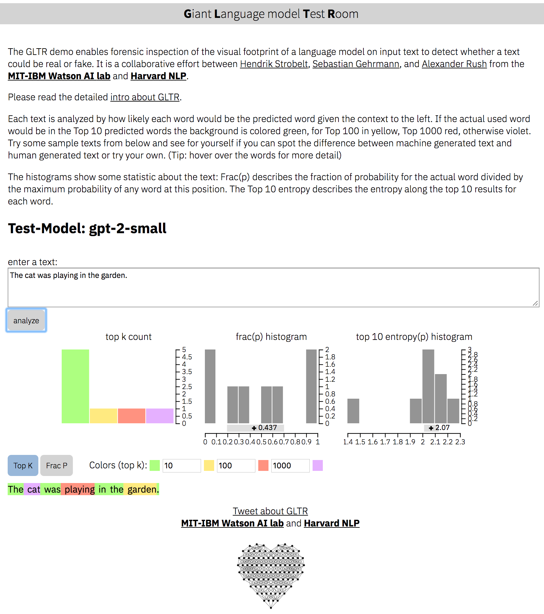

# GLTR: Giant Language Model Test Room
Detecting text that was generated from large language models (e.g. GPT-2).

<a href='http://gltr.io'>
  
</a>


webpage: [http://gltr.io](http://gltr.io)<br>
online-demo: [http://gltr.io/dist/index.html](http://gltr.io/dist/index.html)<br>
paper: [https://arxiv.org/abs/1906.04043](https://arxiv.org/abs/1906.04043) 

A project by Hendrik Strobelt, Sebastian Gehrmann, Alexander M. Rush.

collaboration of MIT-IBM Watson AI Lab and HarvardNLP

## Quickstart

Install dependencies for Python >3.6 :

```bash
pip install -r requirements.txt
```

run server for `gpt-2-small`:

```bash
python server.py

```

the demo instance runs now at [http://localhost:5001/client/index.html](http://localhost:5001/client/index.html)

## Run the BERT server

start the server for `BERT`:
```bash
python server.py --model BERT
```

the instance runs now at [http://localhost:5001/client/index.html?nodemo](http://localhost:5001/client/index.html?nodemo). HINT: we only provide demo texts for `gpt2-small`.


## server.py options

```
usage: server.py [-h] [--model MODEL] [--nodebug NODEBUG] [--address ADDRESS]
                 [--port PORT] [--nocache NOCACHE] [--dir DIR] [--no_cors]

optional arguments:
  -h, --help         show this help message and exit
  --model MODEL		 choose either 'gpt-2-small' (default) or 'BERT' or your own
  --nodebug NODEBUG  server in non-debugging mode
  --port PORT	     port to launch UI and API (default:5001)
  --no_cors          launch API without CORS support (default: False)

```


## Extend backend

The backend defines a number of model api's that can be invoked by the server by starting it with the parameter `--model NAME`. To add a custom model, you need to write your own api in `backend/api.py` and add the decorator `@register_api(name=NAME)`.

Each api needs to be a class that inherits from `AbstractLanguageChecker`, which defines two functions `check_probabilities` and `postprocess`. Please follow the documentation within `api.py` when implementing the class and the functions.


## Extend frontend
the source code for the front-end is in `client/src`.

To modify, installing of node dependencies is necessary:

```bash
cd client/src; npm install; cd ../..
```
re-compilation of front-end:

```bash
> rm -rf client/dist;cd client/src/; npm run build; cd ../..
```

## License

Apache 2

(c) 2019 by Hendrik Strobelt, Sebastian Gehrmann, Alexander M. Rush


